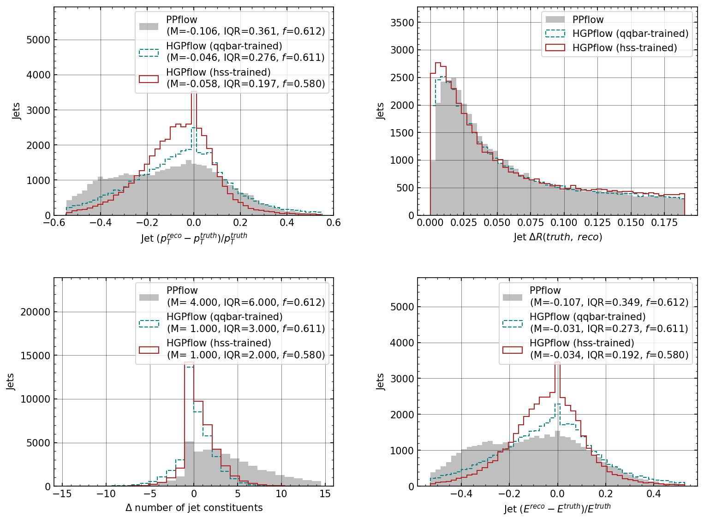
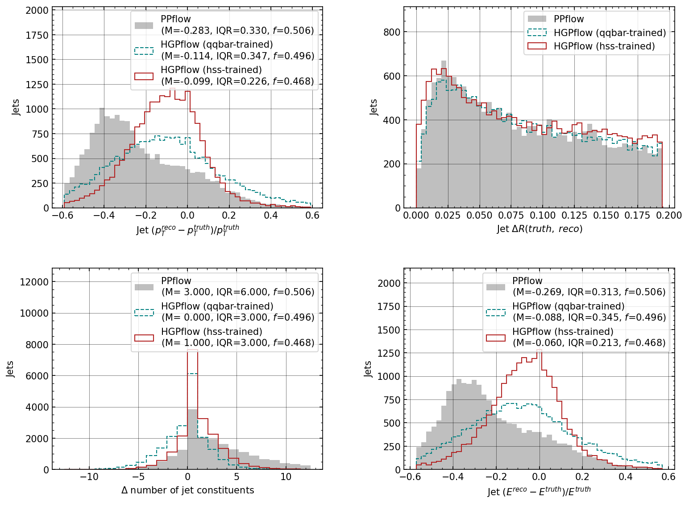
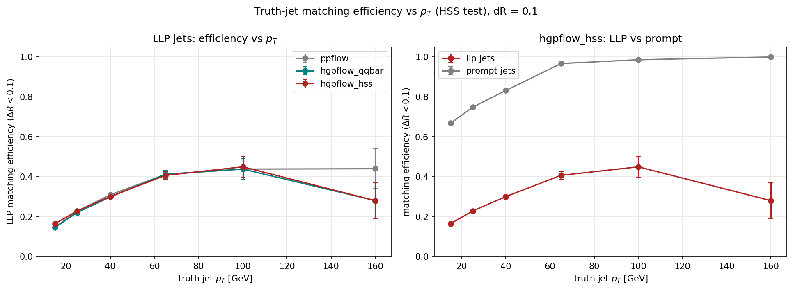
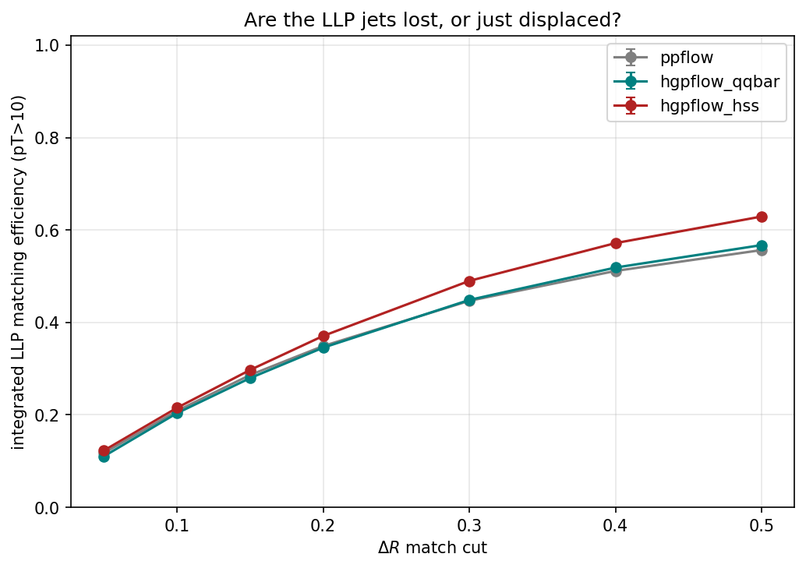
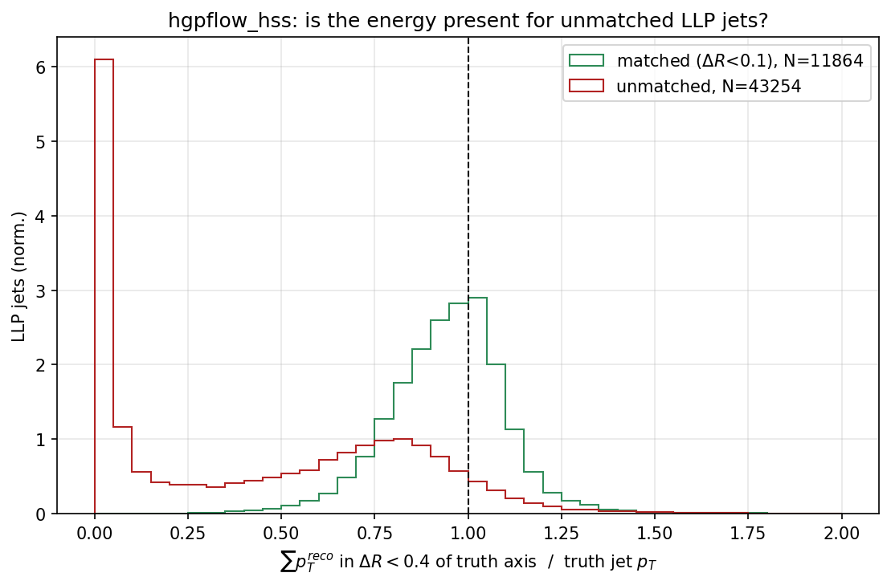
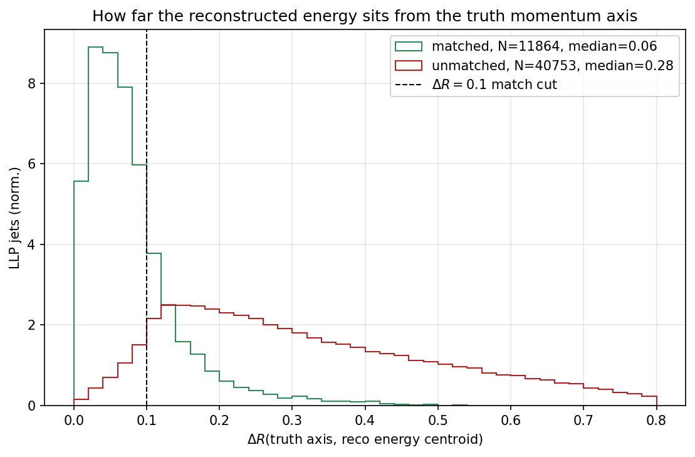
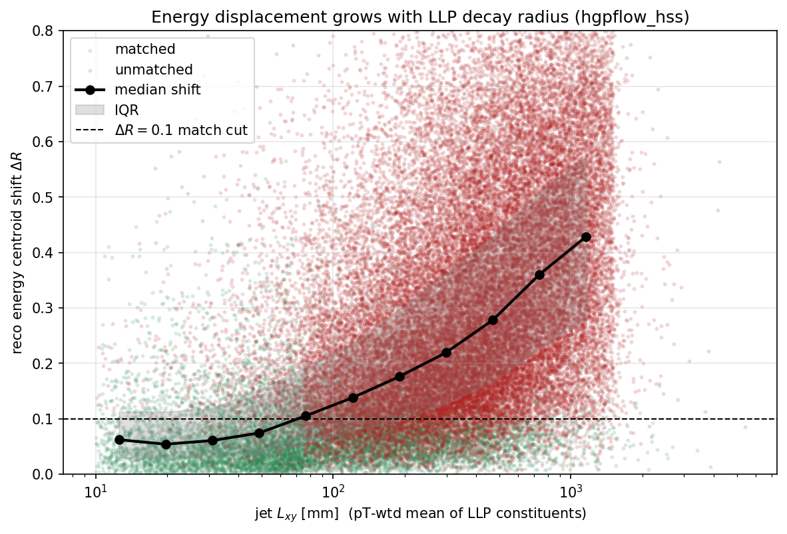
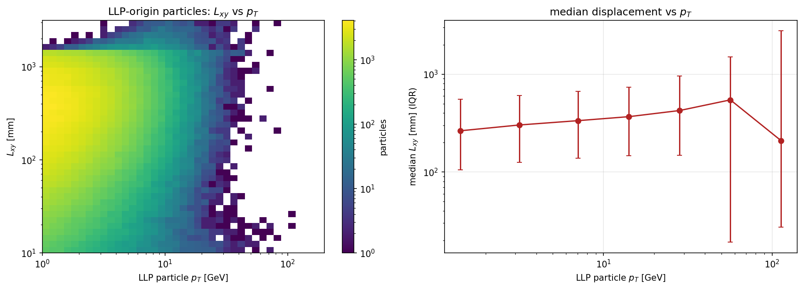

# HGPflow on displaced (LLP) jets — HSS test set

**Sample:** HSS (`H → aa`, pseudoscalar `a` decaying at a displaced vertex), 30k test events
(`cocoa_hss_pflow_30k.root`, with a PPflow baseline).
**Models compared:** HGPflow trained on **qqbar** (out-of-domain) vs trained on **hss** (in-domain),
plus the parametric **PPflow** baseline.
**LLP tag:** a truth particle is *LLP-origin* if its production displacement
`Lxy = √(prod_x² + prod_y²) > 10 mm`; a jet's **LLP fraction** is the pT-weighted fraction of its
constituents that are LLP-origin. Unless noted, "LLP jets" means jets with LLP fraction ≥ 0.9.
**Matching:** truth↔reco jets, anti-kT R=0.4, matched if `ΔR < 0.1` (tight, deliberately).

> ### Where these decays actually happen — read this first
>
> Taken from the truth decay graph (the A⁰ is pdg 36; `node_decx/y/z` is its decay vertex), and
> classified in **full 3D** — these decays are strongly **forward**, so a transverse-only test is
> misleading. Tracker volume = ρ < 1496.5 mm **and** |z| < 3220 mm.
>
> | | inside tracker | in calorimeter | beyond calorimeter |
> |---|---|---|---|
> | **A⁰ decays** (all) | 76.7% | **15.2%** | **8.1%** |
> | **LLP jets analysed here** | 84.8% | **11.2%** | 4.0% |
>
> A⁰ 3D flight distance: median **1103 mm**, 90% **6307 mm**, 99% 14864 mm. Median Lxy 291 mm but
> median |z| **928 mm** — and of the decays that leave the tracker, **89.2% exit through the
> endcap**, only 22.7% through the barrel.
>
> Three consequences:
>
> 1. **The sample spans all three regions.** ~15% of A⁰ decays are at or past the calorimeter, and
>    genuine calorimeter-decay jets are ~11% of the LLP jets analysed — not a negligible tail.
> 2. **A tracking extension addresses the ~77–85% decaying inside the tracker volume** (§7.1, §8),
>    but the ~15% decaying *in* the calorimeter can never be tracked by anything, and need
>    CalRatio / timing / shower-shape methods instead. The ~8% decaying beyond the calorimeter are
>    a genuine acceptance loss, invisible to any jet reconstruction.
> 3. **`Lxy` is a transverse proxy for a sample that is substantially forward.** Every `Lxy`-binned
>    table below (§6.1, §6.5, §7.3) therefore mixes forward decays of large 3D flight distance in
>    with genuinely small displacements, and §6.2 uses the barrel radius R = 1496.5 mm where the
>    endcap distance would be correct for forward decays. Those results should be read as
>    approximate in normalisation; the trends and the mechanism are unaffected.

---

## Executive summary

1. **In-domain training sharpens jet energy resolution dramatically** — the hss-trained model has
   ~28% tighter jet-pT resolution than the qqbar model on all jets and **~42% tighter on LLP jets**,
   with comparable bias and far better than PPflow.
2. **LLP matching efficiency is low (~0.44 ceiling) for *all* models, including the in-domain one.**
   This is **not** an energy loss, a fake-rate artifact, or a model deficiency. §6.5 makes the last
   point directly: displaced jets that still have tracks (3D displacement 10–50 mm) reconstruct at
   **96.7%** axis accuracy — statistically indistinguishable from the 95.8% of prompt jets. HGPflow handles displacement; it is the absence of
   tracks that it cannot handle, and that is upstream of the network.
   Note also that the strong LLP *resolution* in §1 is measured on matched jets only — the
   well-tracked subset — so efficiency, not resolution, is the honest headline (§6.5).
3. **Root cause: geometric displacement, and the operative variable is track coverage.** Without
   tracks (the LLP decays beyond the radius COCOA tracks — though still *inside* the tracker volume,
   see the callout above), the charged decay products are reconstructed from calorimeter energy alone — as *neutrals* — and that energy lands at its **deposit position**, not
   the particle's **momentum direction**. The energy is captured (~85%) but angularly displaced, so it
   fails the momentum-axis match. Jet-axis accuracy tracks the pT fraction carrying a track almost
   perfectly — 65.7% / 35.2% / 9.5% coverage gives 95.8% / 57.7% / 31.3% of jet axes within ΔR<0.1
   (§6.4).
4. **The displacement grows with the decay radius `Lxy`** — demonstrated directly (§3.4) —
   confirming this is a limit of the information *reaching* a prompt-designed reconstruction, *not* a
   training gap (and not an irreducible one — see point 7).
   §6 derives the precise mechanism: the shift is not the raw displacement but the decay's angular
   asymmetry `delta` rescaled by `L/R`, which is why it grows linearly in the decay radius.
5. **The reconstructed "neutral hadrons" in these jets are displaced *charged* hadrons.** The truth
   composition of HSS particles is ~68% charged at *every* `Lxy`; the reco label flips because charge
   in HGPflow is track-seeded, and the training target itself relabels trackless charged hadrons as
   neutral. §5.
6. **Both candidate fixes were tested, and both fail on the existing samples.** Displaced-vertex-aware
   tracking is not implementable: COCOA creates *zero* track objects beyond `Lxy` = 200 mm. Vertex-based
   un-projection works in principle (28% → 59% axis recovery) but needs the decay vertex to ≤ 25 mm,
   and calorimeter-only vertex finding delivers ~1700 mm. §7.
7. **The decays span all three detector regions, and the sample is strongly forward.** From the
   truth decay graph: 76.7% of A⁰ decays are inside the tracker volume, **15.2% in the
   calorimeter**, 8.1% beyond it; of those leaving the tracker, 89.2% exit through the *endcap*
   (§7.1). So the ceiling has two distinct causes — a *simulation* tracking limit for the ~77%
   inside the tracker, and a genuine *physics* limit for the ~15% decaying in the calorimeter,
   which nothing can track. Note `Lxy` is a transverse proxy for a forward sample, so the
   `Lxy`-binned tables mix the two.
8. **What is actionable now is a metric change, not a reconstruction change.** With these inputs the
   displaced-jet axis is not recoverable; the honest response is to stop scoring displaced jets against
   an unobservable momentum axis. §8.

---

## 1. Model comparison: in-domain training buys resolution

Jet-pT residuals `(pT_reco − pT_truth)/pT_truth` for the three collections, all jets and LLP-only
(LLP fraction ≥ 0.9):





| resolution (IQR of pT residual) | PPflow | HGPflow (qqbar) | HGPflow (hss) |
|---|---|---|---|
| all jets | 0.293 | 0.232 | **0.167** (~28% tighter than qqbar) |
| LLP jets | 0.366 | 0.332 | **0.194** (~42% tighter than qqbar) |

Bias (median residual) is comparable between the two models and much better than PPflow on LLP jets
(PPflow systematically under-measures displaced-jet pT by ~18%).

> **The LLP row is survivor-selected.** These residuals are computed on *matched* jets only, which
> for LLP jets means predominantly the well-tracked low-`Lxy` population (§6.5). Read 0.194 as "the
> resolution on displaced jets HGPflow successfully finds", not as the resolution on displaced jets
> in general. §6.5 shows why the two differ so much.

> **Caveat on "matching efficiency" as a metric.** The `f_matched` printed alongside these
> distributions is *reco-jet purity* (fraction of matched pairs passing the cut), whose denominator
> tracks jet **multiplicity** — so the hss model's slightly lower `f` reflects it producing *more*
> jet candidates, not finding fewer true jets. Measuring true jet-finding efficiency (fraction of
> **truth** jets recovered), the hss model is marginally ahead:
>
> | | reco jets/ev | fake rate (ΔR<0.1) | true-jet efficiency |
> |---|---|---|---|
> | truth | 2.816 | — | — |
> | PPflow | 1.894 | 0.467 | 35.9% |
> | HGPflow (qqbar) | 1.926 | 0.478 | 35.7% |
> | HGPflow (hss) | 2.165 | 0.517 | **37.1%** |

---

## 2. The puzzle: why is LLP matching efficiency only ~0.44?

Truth-jet-centric matching efficiency vs pT for LLP jets (fraction of truth LLP jets with a reco jet
within ΔR), for the three collections and, in the right panel, LLP vs prompt for the hss model:



Key observations:

- Efficiency **rises monotonically and plateaus at ~0.44** by 65 GeV — it does **not** turn over at
  high pT (an apparent drop at ~150 GeV was a 25-jet statistical fluctuation).
- The low *integrated* efficiency (~36%) is a **soft-spectrum effect**: ~25k LLP jets sit at 15 GeV
  vs ~25 at 160 GeV, so the low-efficiency threshold bins dominate the average.
- **All three collections plateau at the same ~0.44** above 40 GeV. In-domain training helps only in
  the soft regime (15 GeV: hss 0.165 vs qqbar 0.147, a >10σ gain) and washes out at high pT.
- The plateau **ceiling far below 1** is the real signal — over half of even high-pT LLP jets fail
  the tight match. That both models hit the *same* ceiling means the limit is **upstream of the
  network**, not a training gap.

---

## 3. Diagnosing the ceiling

### 3.1 Are the jets lost, or just displaced? — efficiency vs ΔR cut



Loosening the match cone recovers efficiency substantially but plateaus around **~0.6 even at
ΔR<0.5** (larger than the R=0.4 jet). So the jets are *partly* displaced-but-present and *partly*
something else — motivating a direct energy measurement.

### 3.2 Is the energy there? — reco energy in a cone

Sum of reconstructed particle pT within a cone of each truth LLP jet axis, over the truth jet pT,
split by matched vs unmatched:



| | Eratio (ΔR<0.4 cone) | Eratio (ΔR<0.8 cone) | ⟨charged⟩ | ⟨neut. had⟩ | ⟨photon⟩ |
|---|---|---|---|---|---|
| matched | 0.95 | 1.08 | 0.35 | 0.45 | 0.20 |
| unmatched | 0.43 | **0.85** | 0.07 → 0.13 | 0.74 → 0.70 | ~0.19 |

- **Matched jets** capture ~95% of the energy and retain a real **charged** component (0.35) — i.e.
  they kept tracks, and they reconstruct cleanly.
- **Unmatched jets** capture only 43% within a 0.4 cone but **85% within a 0.8 cone** → the energy is
  **present but displaced** beyond 0.4, not lost. What's recovered is ~90% **neutral** (⟨charged⟩ only
  0.07–0.13): the trackless-charged → neutral flip, as expected.
- Only ~15% is genuinely missing at cone 0.8 (calorimeter under-measurement + any invisible muon/
  neutrino energy).

**Takeaway:** the failure is *position*, not energy. The neutral pathway is the correct *energy*
fallback with no track; it costs resolution, not energy.

> **Read the class columns as reco labels, not physics.** `<charged>`, `<neut. had>` and `<photon>`
> above come from `hgpflow_dict['hgpflow_class']` — the *predicted* class. They do **not** say these
> jets are physically neutral. See §5: at truth level these jets are ~69% charged, and the apparent
> neutral-hadron excess is the trackless-charged relabelling, not a property of the LLP decay.

### 3.3 How far is the energy displaced? — energy centroid shift

ΔR between the truth jet momentum axis and the pT-weighted centroid of the reconstructed energy:



- **Matched:** sharp peak at **0.06** — energy sits on the momentum axis.
- **Unmatched:** **median 0.28, broad and flat out to ~0.8** — displaced well past the 0.1 match cut,
  by a *geometry-dependent* amount with no single scale (the flatness reflects the range of decay
  radii, boosts and opening angles in the sample). A low-shift tail corresponds to a secondary
  failure mode: energy near the axis but **fragmented** into sub-threshold sub-jets.

### 3.4 The causal link — displacement grows with decay radius `Lxy`

Per-jet energy centroid shift vs the jet's LLP decay radius (pT-weighted mean Lxy of its LLP
constituents; alignment self-validated against the stored LLP flag):



The median shift **rises with `Lxy`** and crosses the ΔR=0.1 match threshold around the tracker
radius: the farther out the LLP decays, the farther the reconstructed energy drifts from the momentum
direction, and the jet stops matching. This is the direct, causal demonstration that the efficiency
ceiling is a **displacement effect**.

Supporting context (LLP-origin particle displacement vs pT):



---

## 4. Conclusions from the initial analysis

- **HGPflow reconstructs the LLP energy** — the calorimeter records it and the algorithm recovers
  ~85% of it, correctly as neutral particles since the tracks are absent.
- **The LLP jet-matching ceiling (~0.44 at ΔR<0.1) is a geometric/positional limit**, not an energy
  loss, a fake artifact, or a model shortfall. Without tracks, energy is placed at its deposit
  position rather than its momentum direction, and that offset grows with the decay radius.
- **In-domain (hss) training delivers a large resolution improvement** (~28–42% tighter jet-pT IQR)
  and a marginal jet-finding gain, but **cannot lift the matching ceiling** — the missing information
  (original momentum direction) is not in the inputs.

The original closing bullet proposed two possible fixes — displaced-vertex-aware tracking, or a
displacement-aware clustering/matching scheme. **Sections 5–8 test both. Both fail on the existing
samples**, for different and independently measured reasons. §8 states what is actually actionable.

---

## 5. The reconstructed "neutral hadrons" are displaced *charged* hadrons

`H → aa` with `a → qq̄` produces ordinary quark jets, so the displaced jets should have ordinary
composition. They do. Truth composition of HSS particles by production radius (3k val events,
pT > 0.5 GeV, |η| < 2.5, pT-weighted):

| Lxy [mm] | charged | neut. had | photon | ch. **with** track | ch. **without** track |
|---|---|---|---|---|---|
| 0–1 | 67.6% | 13.3% | 19.1% | 67.6% | 0.0% |
| 1–10 | 65.9% | 13.6% | 20.5% | 65.7% | 0.2% |
| 10–50 | 69.3% | 13.0% | 17.7% | 63.3% | 6.0% |
| 50–200 | 68.9% | 10.8% | 20.3% | 11.7% | 57.2% |
| 200–1000 | 69.1% | 10.8% | 20.1% | 0.0% | 69.1% |
| >1000 | 62.4% | 18.1% | 19.5% | 0.0% | 62.4% |

The composition is **flat in `Lxy`** — displaced jets are not neutral-rich in any physical sense.
Against the §3.2 reco numbers for unmatched jets:

| | charged | neut. had | photon |
|---|---|---|---|
| truth (Lxy 200–1000) | 69% | 11% | 20% |
| reco (unmatched jets) | 7% | 74% | 19% |

**The photon fraction is the control and it is preserved (20% → 19%)** — photons are genuinely
neutral and are labelled correctly. Charged goes 69% → 7% while neutral hadron goes 11% → 74%: a
near-exact 1:1 transfer of ~62% of the jet energy from one class into the other.

This is not only an inference artifact. At `hgpflow_v2/dataset/dataset_mini.py:179-184` the *training
target* is redefined — `flat_trackless_chhad_and_e_mask` shifts class 0 (charged hadron) to class 3
(neutral hadron) — so the network is explicitly taught that a trackless charged pion is a neutral
hadron. Combined with `proxy_is_charged = track_eye.sum(dim=2).bool()`
(`hgpflow_v2/models/hgpflow_model.py:108`), charge is structurally track-seeded and there is no path
to a "charged" output without a track. Energy fraction HGPflow can even in principle call charged:

| Lxy [mm] | truly charged | can be called charged | forced to neutral |
|---|---|---|---|
| 0–10 | 67.5% | 67.4% | 0.0% |
| 10–200 | 69.0% | 25.8% | 43.2% |
| >200 | 67.9% | 0.0% | 67.9% |

**Consequence.** For jet *energy* this is benign — the calorimeter does not care about the label. It
matters for hadronic calibration (charged and neutral hadron response differ) and for any downstream
observable built on charged multiplicity or vertex structure.

---

## 6. Why the `a`'s straight flight does not protect the jet axis

The `a` is electrically neutral, so it does not bend: it flies straight from the primary vertex and
its decay vertex sits exactly on the `n̂` ray at radius `L`. Momentum conservation makes `Σp⃗` point
along `n̂`. Neither fact rescues the match, and the reason is worth stating precisely.

### 6.1 The decay products *are* charged, but bending switches off with `Lxy`

The field fills the tracker volume regardless of what entered it, so the charged decay products bend
from the decay point outward — but with a shortened lever arm. Bending is charge-coherent while
geometry is not, so signing Δφ by charge isolates it (π±/K±/p, pT > 1 GeV):

| Lxy [mm] | N | median q·Δφ (bending) | median \|Δφ\| (total) |
|---|---|---|---|
| 0–1 | 42878 | **−0.350** | 0.352 |
| 1–10 | 2061 | −0.226 | 0.226 |
| 10–50 | 4368 | −0.275 | 0.276 |
| 50–200 | 10939 | −0.245 | 0.247 |
| 200–1000 | 18399 | −0.093 | 0.170 |
| >1000 | 3567 | **0.0000** | 0.166 |

At prompt radii the offset is *entirely* bending (signed and unsigned medians agree to three
decimals) — which is the method's own sanity check, since a particle born at the origin has zero
geometric displacement by construction. Past 1 m the coherent part is exactly zero while ~0.17 of
incoherent offset remains: bending has switched itself off and what survives is pure geometry.

> **Why `Lxy` and not 3D distance here.** Bending is driven by the **transverse** lever arm, so
> `Lxy` is the correct ordering variable for *this* table even though the sample is forward — a
> particle at 3D distance 500 mm that is mostly forward still has nearly the full transverse path
> to the calorimeter and bends like a prompt one. Re-binning by 3D distance actually *mixes*
> bending behaviour (the 200–1000 mm bin then reads −0.217 instead of −0.093). Track availability
> and the jet-axis result are the opposite case and need 3D distance (§6.5, §7.1).
>
> **How to read this table.** It identifies *what kind* of offset dominates at each radius — that
> is what licenses the straight-line un-projection of §7.2, which is only well-posed once bending
> is gone. It does **not** predict matching efficiency: these are per-particle medians in one
> coordinate, computed as though deposit positions were used for every particle. Prompt jets never
> live in that hypothetical — they have tracks. For the jet-level consequence see §6.4, and note
> that the per-particle offset actually *shrinks* with `Lxy` (0.35 → 0.17) while matching gets
> worse, so offset size is not the operative variable. The two effects are conveniently
anti-correlated in `Lxy` — where bending is large, tracks still exist (§7.1); where tracks vanish,
bending vanishes too.

Per-particle deposit-vs-momentum ΔR, split by charge, shows the same trade-off:

| Lxy [mm] | neutral | charged |
|---|---|---|
| 0–1 | 0.004 | 0.307 |
| 10–50 | 0.027 | 0.269 |
| 50–200 | 0.095 | 0.307 |
| 200–1000 | 0.292 | 0.350 |
| >1000 | 0.370 | 0.447 |

### 6.2 The mechanism: `delta · L/R`

For a product emitted at angle `θ` from `n̂`, decaying at radius `L`, landing on a calorimeter at
radius `R`:

```
momentum angle from n̂ =  θ
deposit  angle from n̂ =  θ · (1 − L/R)      <- deposits collimate toward n̂
```

Both distributions stay *centred* on `n̂`, so a perfectly balanced decay would suffer no centroid
shift at all. But a jet axis is an energy-weighted **angular position**, not a vector sum. The
centroid of an asymmetric decay sits off-axis at some `delta`; the rescaling drags the deposit
centroid to `delta(1 − L/R)` while the momentum centroid stays at `delta`. The residual is

```
jet-axis shift  =  delta · L/R          (linear in decay radius, zero only for a balanced decay)
```

Measured, comparing like with like (both pT-weighted centroids, so no estimator mismatch):

| Lxy [mm] | N | ΔR(momentum centroid, deposit centroid) |
|---|---|---|
| 0–10 | 2374 | 0.089 |
| 10–200 | 870 | 0.093 |
| 200–500 | 704 | 0.200 |
| 500–1000 | 581 | 0.327 |
| >1000 | 243 | 0.356 |

Subtracting the prompt baseline, the shift rises steadily with displacement, as the mechanism
requires.

**A correction to an earlier version of this section.** That version divided `Lxy` by the *barrel*
radius (1496.5 mm) to form `L/R` and obtained `delta` = 0.497 rad, against a measured angular
spread of 0.554 rad — an apparently striking ~10% agreement. That agreement was an artifact of
using a barrel radius for a strongly forward sample. Computing `L/R` correctly — per particle, as
the ratio of the true 3D flight distance to the true 3D distance to that particle's deposit
(barrel or endcap) — gives:

| ⟨L/R⟩ bin | N | median shift | implied `delta` = shift/⟨L/R⟩ |
|---|---|---|---|
| <0.05 (baseline) | 2575 | 0.083 | — |
| 0.05–0.15 | 421 | 0.074 | −0.139 |
| 0.15–0.30 | 426 | 0.145 | 0.263 |
| 0.30–0.50 | 436 | 0.234 | 0.374 |
| 0.50–1.01 | 914 | **0.407** | 0.397 |

**What survives:** the shift grows monotonically with `L/R`, by roughly a factor of 5 across the
range, which is the mechanism's central prediction and is solid.

**What does not:** `delta` is *not* constant across bins (0.26 → 0.40), so the simple
`shift = delta · L/R` form is an approximation that degrades at large `L/R` — unsurprising, since
its derivation assumed small emission angles and these decays have a 0.554 rad spread. The
quantitative closure with the measured angular spread claimed earlier does not survive the fix.
Treat §6.2 as establishing the *mechanism and its scaling*, not a calibrated relation.

---

### 6.3 These decays are wide### 6.3 These decays are wide, which is why `delta` is large

| quantity | value |
|---|---|
| decay invariant mass (median) | 18.3 GeV |
| boost `E/m` (median) | 3.1 |
| pT-weighted angular spread about the `a` axis | 0.554 rad |
| decays too wide to form one R=0.4 jet | **55.6%** |

So the jets being matched are frequently *sub-parts* of a decay, and a sub-part inherits no
protection from momentum conservation. The `(1 − L/R)` collimation additionally makes deposit space
narrower than momentum space, so anti-kT merges differently in the two and fragments fall below the
8 GeV / 2-constituent thresholds in `hgpflow_v2/performance/jet_helper.py:66` — this is the §3.3
"energy near the axis but fragmented into sub-threshold sub-jets" tail, now with a mechanism.


### 6.4 The net effect at jet level: track coverage is the variable

Building each truth jet's axis the way HGPflow effectively does — direction from the **track**
where a track exists, from the **deposit position** where it does not — and comparing to the truth
momentum axis (2000 events; same constituent set for both jets, so only *position* varies):

| jet type | N | pT frac with a track | **realistic** med ΔR | <0.1 | <0.2 | deposits for **all**, med ΔR | <0.1 |
|---|---|---|---|---|---|---|---|
| prompt (llp_frac < 0.1) | 1346 | **65.7%** | **0.0015** | **95.8%** | 99.3% | 0.0588 | 75.0% |
| mixed (0.1–0.9) | 1218 | 35.2% | 0.0658 | 57.7% | 72.7% | 0.1168 | 44.8% |
| LLP (llp_frac ≥ 0.9) | 4067 | **9.5%** | **0.2101** | **31.3%** | 48.5% | 0.2130 | 27.6% |

The result is monotonic in **track coverage** and in nothing else:

```
pT fraction carrying a track   65.7%  ->  35.2%  ->   9.5%
jet axis within dR < 0.1       95.8%  ->  57.7%  ->  31.3%
```

- **Prompt jets are accurate because two thirds of their pT carries a track** (exact direction), and
  their remaining neutrals have deposit ≈ momentum anyway (0.004, §6.1). Both components are right,
  so the axis is right — median ΔR = 0.0015. Bending never enters, because deposit positions are
  barely used.
- **The right-hand block is the hypothetical where the tracks are discarded.** Prompt jets fall to
  75.0%, so bending *would* cost something — but only mildly, and it is not what makes prompt jets
  match. It is a correction to a situation that does not arise.
- **LLP jets barely move between the two blocks** (31.3% → 27.6%): at 9.5% coverage they are already
  in the trackless regime, so removing the remaining tracks changes almost nothing. This is the same
  statement as §7.1 — past 200 mm there is nothing left to lose.

The realistic LLP figure of **31.3%** is a truth-level calculation with perfect energy and perfect
clustering, and it already sits close to the ~36% integrated efficiency measured on reconstructed
jets in §2. That agreement is the strongest single indication that the ceiling is set by geometry
upstream of the network, not by the network.

> This supersedes an intermediate azimuthal-only measurement of the jet-level shift (prompt 0.046,
> LLP 0.088). That quantity is real but assumed deposit positions for *every* constituent, which is
> the wrong hypothetical for prompt jets, and two medians in one coordinate cannot support a claim
> about pass rates in any case.


### 6.5 Is HGPflow the limitation, or are the inputs? — the decisive test

Take LLP jets **only** and bin them by displacement, building the axis as in §6.4. The ordering
variable must be **3D production distance**, not `Lxy`: COCOA's track availability depends on both
coordinates (§7.1), and this sample is strongly forward, so a transverse-only binning mixes
well-tracked central decays with untracked forward ones.

| 3D distance [mm] | N | pT frac with a track | median ΔR | axis <0.1 | <0.2 |
|---|---|---|---|---|---|
| 10–50 | 150 | **69.4%** | **0.0045** | **96.7%** | 100.0% |
| 50–150 | 597 | 49.2% | 0.0195 | **93.3%** | 99.3% |
| 150–300 | 829 | 22.5% | 0.0684 | 68.3% | 95.7% |
| 300–600 | 1309 | 7.7% | 0.1414 | 33.6% | 72.8% |
| 600–1200 | 1790 | 1.6% | 0.2576 | 10.7% | 35.0% |
| >1200 | 3524 | 0.8% | 0.4753 | 19.2% | 25.4% |

**Jets whose decay is 10–50 mm from the origin reconstruct at 96.7% — statistically
indistinguishable from prompt jets (95.8%, §6.4) — and the 50–150 mm bin is still 93.3%.** These
are genuinely displaced decays. Displacement *per se* does not degrade the reconstruction at all.
Accuracy collapses in lockstep with track coverage, 69.4% → ~1%, and with nothing else.

> **This supersedes an `Lxy`-binned version** which reported 86.4% in its leading bin. That binning
> diluted the result by mixing forward decays — large 3D flight distance, small transverse radius,
> and no tracks — into the low-`Lxy` bins. The corrected result is *stronger*: on the right axis,
> tracked displaced jets are as good as prompt jets, not merely close.

**So HGPflow is not the bottleneck; the track collection is.** The algorithm handles displaced jets
well when the directional information is present, and cannot invent it when it is not — as no
particle-flow algorithm consuming these inputs could. That is a materially different conclusion
from "HGPflow reconstructs displaced jets poorly", and it is the one the data supports.

90.9% of LLP jets sit above 150 mm in 3D distance, where coverage is ≤22%. That is the population
any tracking extension would have to reach, and the 96.7% / 93.3% rows are the quantified estimate
of what reaching it buys.

> The `<0.1` fraction ticks up in the last two rows while the median keeps degrading (0.29 → 0.41 →
> 0.43). That is the distribution going bimodal as `L → R`, not performance recovering.

#### This dissolves the "strong resolution, low efficiency" tension

The two metrics measure **different populations**, not conflicting things:

- The **IQR of 0.194** (§1) is computed on *matched* jets. §3.2 shows matched LLP jets retain a real
  charged component (⟨charged⟩ = 0.35), i.e. they are predominantly the well-tracked
  small-displacement population — the 96.7% / 93.3% rows above.
- The **efficiency** is computed over *all* LLP truth jets, including the untracked bulk.

So "excellent resolution but low efficiency" is one fact seen twice: the tracked subset reconstructs
excellently, the untracked subset not at all, and the resolution metric only ever sees the
survivors. This is the survivor bias `llp_helper.py` warns about in its docstring, and it is why the
**efficiency is the more honest headline of the two** — a resolution quoted on a 30%-selected subset
is not a statement about displaced-jet reconstruction in general.

---

## 7. Can it be fixed? Both routes measured

### 7.1 Displaced-vertex-aware tracking — there are no track objects to work with

**First, where the decays are.** From the truth decay graph (A⁰ = pdg 36), classified in full 3D —
tracker volume = ρ < 1496.5 mm **and** |z| < 3220 mm:

| | inside tracker | in calorimeter | beyond calorimeter | median Lxy | median \|z\| |
|---|---|---|---|---|---|
| A⁰ decays (all), N=7713 | 76.7% | **15.2%** | **8.1%** | 291 mm | 928 mm |
| LLP jets analysed, N=7384 | 84.8% | **11.2%** | 4.0% | 319 mm | 802 mm |

A⁰ 3D flight distance: median 1103 mm, 90% 6307 mm. Of the decays leaving the tracker, **89.2% exit
through the endcap** — this is a forward sample, which is why a transverse-only classification
misleads.

So the population splits three ways, and the three parts have genuinely different prospects: the
~77% decaying inside the tracker volume are trackable in principle, the ~15% decaying inside the
calorimeter are not trackable by anything, and the ~8% decaying beyond it are lost entirely.

**Second, track availability****Second, track availability** (2k val events, charged particles, pT > 0.5 GeV):

| Lxy [mm] | N charged | track entry exists | in acceptance | reconstructed | linked to particle |
|---|---|---|---|---|---|
| 0–1 | 33683 | 99.9% | 99.9% | 99.9% | 99.9% |
| 1–10 | 1745 | 98.5% | 98.5% | 98.5% | 98.5% |
| 10–50 | 3473 | 88.5% | 88.5% | 88.5% | 88.5% |
| 50–200 | 9121 | 16.0% | 16.0% | 16.0% | 16.0% |
| 200–1000 | **16141** | **0.0%** | 0.0% | 0.0% | 0.0% |
| >1000 | 2738 | **0.0%** | 0.0% | 0.0% | 0.0% |

All four columns are identical — this is not an efficiency or acceptance loss that could be loosened.
COCOA's parametric tracker never *creates* a track object past ~200 mm: no entry in
`track_parent_idx`, no hits, nothing for a large-radius algorithm to run on. The modal displaced
population (16k of ~31k charged LLP particles) sits exactly where availability is identically zero.

**The cutoff is not on `Lxy` alone.** Linked-track fraction in 2D (charged, pT > 0.5 GeV):

| Lxy \\ \|z\| | 0–200 | 200–600 | 600–1500 | 1500–3220 |
|---|---|---|---|---|
| 0–10 | 100% | 82% | — | — |
| 10–50 | 100% | 79% | **0%** | **0%** |
| 50–200 | 31% | 15% | 0% | 0% |
| 200+ | 0% | 0% | 0% | 0% |

A particle at `Lxy` = 30 mm with |z| = 800 mm has **zero** track availability, while one at
`Lxy` = 30 mm, |z| = 100 mm has 100%. Binned by **3D distance** the availability is clean and
monotonic — 100%, 100%, 60.6%, 12.6%, 0%, 0% across 0–10, 10–50, 50–200, 200–600, 600–1500,
>1500 mm — which is why 3D distance is the correct ordering variable throughout §6.5.

**Verdict: not implementable on these samples — and for most, though not all, of the population this
is a simulation limit rather than a physics one.** About 77% of A⁰ decays are inside the tracker
volume, i.e. in a region a real detector instruments and where large-radius tracking is designed to
work. The remaining ~23% decay in or past the calorimeter and are beyond any tracking fix. Recovering them requires
regenerating all 295k events with a modified COCOA tracking configuration, then re-splitting,
re-deriving input scales, and retraining both stages. That is weeks of work, but it is *ordinary*
work against a target real experiments already reach — not an attempt to beat an information limit.
Contrast §7.3, which is blocked on information and would not be rescued by regeneration.

### 7.2 Displacement-aware un-projection — works, but needs a 25 mm vertex

For a straight-line particle, knowing the vertex **v** and the deposit position **x** gives the
momentum direction exactly as `m̂ = (x − v)/|x − v|` — no regression, closed form. Oracle test on
6128 LLP truth jets (llp_frac ≥ 0.9, anti-kT R=0.4, pT > 8 GeV), same constituent set for both jets
so that only *position* varies:

| jet axis built from | median ΔR to truth axis | frac < 0.1 | frac < 0.2 |
|---|---|---|---|
| deposit positions (what reco sees) | 0.208 | **28.0%** | 48.6% |
| un-projected, exact per-particle vertex | 0.074 | **59.9%** | 74.5% |
| un-projected, ONE jet vertex (perfect) | 0.076 | **58.9%** | 74.2% |
| ONE jet vertex, smeared 10 mm | 0.080 | 57.7% | 73.9% |
| ONE jet vertex, smeared 25 mm | 0.092 | 53.1% | 72.3% |
| ONE jet vertex, smeared 50 mm | 0.118 | 43.0% | 67.7% |
| ONE jet vertex, smeared 100 mm | 0.173 | 25.4% | 56.0% |
| ONE jet vertex, smeared 200 mm | 0.293 | 10.2% | 31.9% |

Three readings:

- **One vertex per jet is enough.** Exact per-particle vertices give 59.9%, a single shared jet vertex
  58.9%. The shared-vertex assumption costs one percentage point.
- **Bending sets the ceiling.** Re-running with straight-line propagation for everything (bending
  absent) recovers **94.9%**. With real bending it is 58.9%. The missing ~40% is irreducible magnetic
  deflection of the charged constituents, unrecoverable without tracks.
- **The vertex must be known to ≲25 mm.** At 50 mm the gain is halved; at 100 mm the result is no
  better than doing nothing.

### 7.3 Calorimeter vertex resolution — short by a factor of ~70

The depth lever arm exists: **82.5%** of displaced particles produce ≥2 topoclusters, with a median
radial span between barycentres of **619 mm** (median cell-level radial extent 747 mm). But the axes
those clusters define are poor:

| line source | N | impact param to true vertex | angle error vs momentum |
|---|---|---|---|
| cells (all) | 7672 | 632 mm | 24.5° |
| cells (neutral) | 2766 | 314 mm | 12.4° |
| cells (charged) | 4906 | 857 mm | 33.1° |
| **topo barycentres (all)** | 6443 | **1072 mm** | **40.8°** |
| topo barycentres (neutral) | 2204 | 1046 mm | 40.2° |

A single shower axis is good to ~12° at absolute best (neutral, cell-level) and ~41° from the
topocluster barycentres the network actually sees — *worse* than cells, because 2–3 barycentres are
dominated by lateral shower fluctuation. Fitting a common vertex from these lines:

| source | N | median \|Δv\| (3D) | median ΔLxy |
|---|---|---|---|
| topo barycentres | 1927 | **1748 mm** | 758 mm |
| cells (upper bound) | 2219 | 1542 mm | 662 mm |
| topo, neutrals only | 777 | 1750 mm | 799 mm |

More constituents barely help (2 lines → 1826 mm; 8+ lines → 1621 mm) because the lines are nearly
parallel and the fit is ill-conditioned along the flight direction.

**Required ≤25 mm; achieved ~1700 mm — short by a factor of ~70.** Calorimeter-only displaced vertex
finding at COCOA granularity cannot support the un-projection. This is an information limit, not an
effort limit.

---

## 8. Revised conclusions and recommendation

1. **The §1 result stands and is the real deliverable.** In-domain training buys ~28–42% tighter
   jet-pT resolution. That is a genuine, usable improvement.
2. **On the *existing samples*, the ceiling is not fixable by reconstruction.** Both routes named in
   the original §4 have been measured and both are blocked *here*: no track objects exist past
   200 mm (§7.1), and the vertex needed for un-projection is ~70× beyond calorimeter reach (§7.3).
   This is a statement about these inputs, not about the algorithm or about displaced jets in
   general — see point 5, which is the constructive counterpart.
3. **Do not build the calorimeter-pointing / vertex-finding head.** §7.3 is the gate and it fails,
   by a factor of ~70. Unlike the tracking route, this one is blocked on *information*, so
   regenerating the samples would not rescue it either.
4. **Do change the matching metric — this is the one clearly viable action.** Scoring a
   calorimeter-built object against a momentum axis defined by an unobservable vertex compares
   incommensurable quantities. Two options, both cheap and neither requiring retraining:
   - an **energy-overlap match** (for each truth jet take the reco jet maximising shared pT in the
     cone, match above ~50%), reusing the §3.2 cone machinery;
   - a **truth calo-axis match**, building the truth reference jet from
     `particle_eta_extrap_calo` / `particle_phi_extrap_calo` (already in the raw file; add them to the
     read list in `hgpflow_v2/performance/reader.py:158` following the `particle_llp_origin` pattern
     at lines 131–166 so they ride the same fiducial cut).

   Note the ΔR<0.2 column in §7.2: the uncorrected deposit baseline is already 48.6% there versus
   28.0% at ΔR<0.1. Simply reporting the metric honestly recovers a large share of what the entire
   vertex-finding programme would have bought.
5. **HGPflow itself is sound on displaced jets — the inputs are the limit, and the fix is a
   tracking extension with a quantified payoff.** §6.5 is the key evidence: LLP jets whose decay is
   10–50 mm from the origin reconstruct at **96.7%** axis accuracy — indistinguishable from the
   95.8% of prompt jets — because 69.4% of their pT still carries a track, and the 50–150 mm bin is
   still 93.3%. Displacement does not break the algorithm; absent tracks do. 90.9% of LLP jets sit
   above 150 mm in 3D distance where coverage is ≤22%, and that is the population a tracking
   extension would recover.

   **The target is well-defined but partial.** 76.7% of A⁰ decays are inside the tracker volume
   (§7.1), i.e. where real large-radius tracking already operates — extending COCOA's tracking there
   is ordinary work, not an attempt at the impossible. But **~15% decay inside the calorimeter and
   ~8% beyond it**, and no tracking extension touches those. For the calorimeter-decay component the
   field's own answer applies instead — CalRatio (E_HCAL/E_ECAL), jet timing, and longitudinal
   shower profile, which treat tracklessness as the *signature* rather than a defect. HGPflow already
   ingests `topo_ecal_e` / `topo_hcal_e` (as `em_frac`), so that information is in its inputs.

   That makes resimulation a *quantified* proposal rather than a speculative one: modify the COCOA
   tracking parametrisation to reconstruct tracks from displaced production vertices, regenerate
   250k/15k/30k, re-split, re-derive scales, retrain both stages. The physical headroom is real —
   the calorimeter face is at ~1496 mm, so roughly 1.3 m of tracking volume exists, and COCOA's
   sharp cutoff at 200 mm production radius is a property of its parametric tracking model, not an
   inherent limit of that volume. It is also the *only* route: the raw file stores fitted track
   parameters plus extrapolations to the six calorimeter layers (ρ 1547 → 3825 mm) and **no tracker
   hits at all**, so pattern recognition cannot be rerun offline.

   Expected payoff, read off §6.5: extending coverage into the 150–1200 mm band should move those
   jets from ~10–30% toward the 93–97% seen where tracks exist. That is the experiment that would answer
   "can HGPflow reliably reconstruct displaced jets?" — and everything measured here says the answer
   would be yes.
6. **A separate, smaller question**: whether HGPflow should be able to *label* displaced particles as
   charged (§5). The prior is favourable — at Lxy > 200 mm, 69/(69+11) ≈ 86% of non-photon energy is
   charged — but a trackless π± shower and a K_L shower are both trackless hadronic showers, so
   per-object discrimination is weak and the prior does most of the work. It affects calibration and
   charged-multiplicity observables, not jet energy.

---

## Methodology notes & caveats

- Two `PerformanceCOCOA` objects (one per model) share one truth file, so the PPflow baseline and
  truth jets are identical across the comparison. Event alignment was checked (corr ≈ 0.9+).
- The tight `ΔR < 0.1` match cut is deliberate; absolute efficiencies are cut-dependent (see §3.1),
  but the *model comparisons* and the *displacement mechanism* are not.
- `Eratio` uses reconstructed-particle pT within a fixed cone of the **truth** axis; centroid shift is
  computed relative to the truth axis (no φ-wrap issues). Both use pT weighting, so the dominant
  energy sets the measured position.
- The `Lxy`-vs-shift figure re-reads the production vertex from the raw file and re-applies the exact
  loader fiducial cut; alignment is asserted against the stored per-particle LLP flag before plotting.
- Statistics thin out above ~80 GeV (few hundred LLP jets and fewer); high-pT points carry large
  binomial errors and should not be over-interpreted.

### Notes on the §5–§7 measurements

- All of §5–§7 is measured on the **raw** generation file
  `/pscratch/sd/a/agolub/hss_events/cocoa_hss_val_15k.root` (`Out_Tree`), 200–3000 events depending on
  the quantity (cell-level studies use fewer events because the cell branches are large). None of it
  depends on a trained model, so it is a statement about the sample and the detector, not about
  HGPflow.
- Particle classes use `hgpflow_v2.utility.helper_dicts.pdgid_class_dict` (0 ch.had, 1 e, 2 mu,
  3 neut.had, 4 photon), matching the convention in the reco class columns of §3.2.
- **Calorimeter geometry** was determined empirically from the stored extrapolation: barrel
  ρ ≈ 1496.5 mm, endcap |z| ≈ 3220 mm. The straight-line ray-to-surface model was validated against
  `particle_eta_extrap_calo`/`particle_phi_extrap_calo`: median ΔR = **0.0075** for neutrals
  (confirming the model) and **0.278** for charged (which *is* the bending, consistent with the
  charge-signed measurement in §6.1). The §7.2 oracle uses the stored extrapolated positions, so
  bending is fully present.
- **Bending is isolated by charge-signing** Δφ and restricted to π±/K±/p, where `sign(pdgid)` equals
  the electric charge. Geometry contributes with random sign and cancels in the median.
- **Decay grouping** (§6.2, §6.3, §7.3) groups final-state particles by production vertex rounded to
  5 mm. This is imperfect: the raw file has no `particle_parent_idx`, so decay chains cannot be
  reconstructed and secondary decays (e.g. K_S → ππ downstream) contaminate the grouping. Quantities
  derived from it are indicative rather than exact — this is why §6.2 compares *like-with-like*
  centroids and reads the *slope* rather than absolute values.
- **A superseded test**: an earlier attempt compared a vector-sum axis against a coordinate centroid.
  That mismatch alone is worth ΔR ≈ 1.19 on prompt groups and invalidated the comparison. §6.2 uses
  two pT-weighted centroids throughout.
- **§7.2 is an upper bound on axis recovery, not a predicted efficiency.** It uses truth particles with
  the same constituent set for both jets — perfect energy, perfect clustering, no thresholds. Real
  performance will be lower: HGPflow particle positions carry resolution, reco clustering differs from
  truth clustering, and the 56%-too-wide fragmentation problem (§6.3) is untouched. Do not compare its
  28% baseline against the 0.44 plateau of §2 — different selections and different quantities. The
  trustworthy number is the ratio (~2×).
- **§7.3 uses truth cell→particle links** (`cell_parent_idx`) to group showers before fitting. A real
  algorithm would have to do that grouping itself, so the quoted ~1700 mm is a *best case*.
- **Is the transverse-only LLP tag a problem? No — checked.** `llp_lxy_mm = 10` tags on `Lxy`
  alone, which on a forward sample looks like it should miss decays at large |z| and small
  transverse radius. Measured, it barely does: only **2.3%** of displaced pT (3D displacement
  > 10 mm) fails the transverse tag, and at jet level only **81 of 11286** jets are "prompt by
  `Lxy`, LLP in 3D" (0.7%), with **zero** going the other way. Those 81 have track coverage 67.6%
  and 93.8% axis accuracy — indistinguishable from the true prompt jets (64.7%, 96.9%) — so they do
  not drag the prompt control. The reason is geometric: reaching |z| = 2000 mm with `Lxy` < 10 mm
  requires |η| ≳ 6, far outside acceptance, so within |η| < 2.5 any genuinely displaced decay
  accumulates `Lxy` > 10 mm.

  The distinction worth remembering: **the tag is a threshold near zero, where `Lxy` and 3D
  distance agree for anything in acceptance; the *binning* asks "how displaced", at large distances
  where they diverge badly.** The tag was never the problem — using `Lxy` as an ordering variable
  was (§6.5, §7.1). §1–§3 are unaffected.
- **The primary vertex is unsmeared**, which is what makes a 3D displacement measure valid at all:
  particles with `Lxy` < 0.5 mm have median |z| = 0.000 mm, and the per-event PV z has std
  0.157 mm. So 3D distance from the origin is a genuine displacement, not a beamspot artifact.
- **Scripts**: every table in §5–§7 is reproduced by a script in
  [`llp_studies/`](llp_studies/) — see that directory's `README.md` for the script → section map
  and the run command. They read the raw file only and need no trained checkpoint.

*Figures generated from `cocoa_qqbar_vs_hss_performance.ipynb`. Sections 5–8 added following the
follow-up analysis of the displacement mechanism and the feasibility of the two proposed fixes.*
